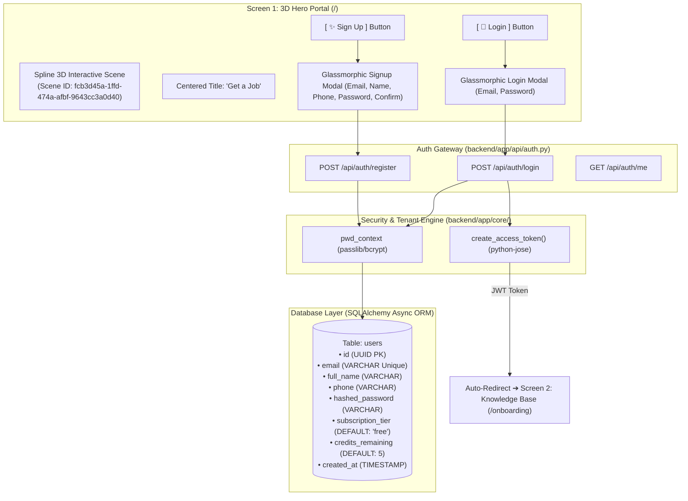
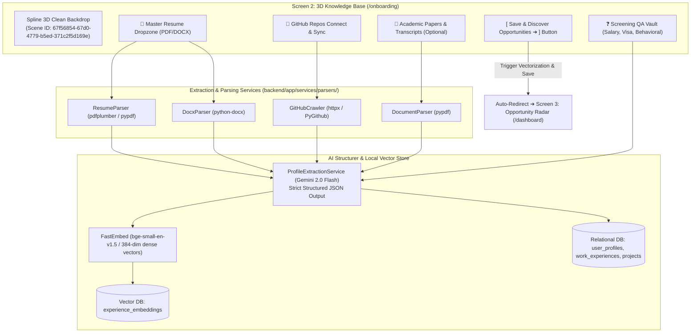
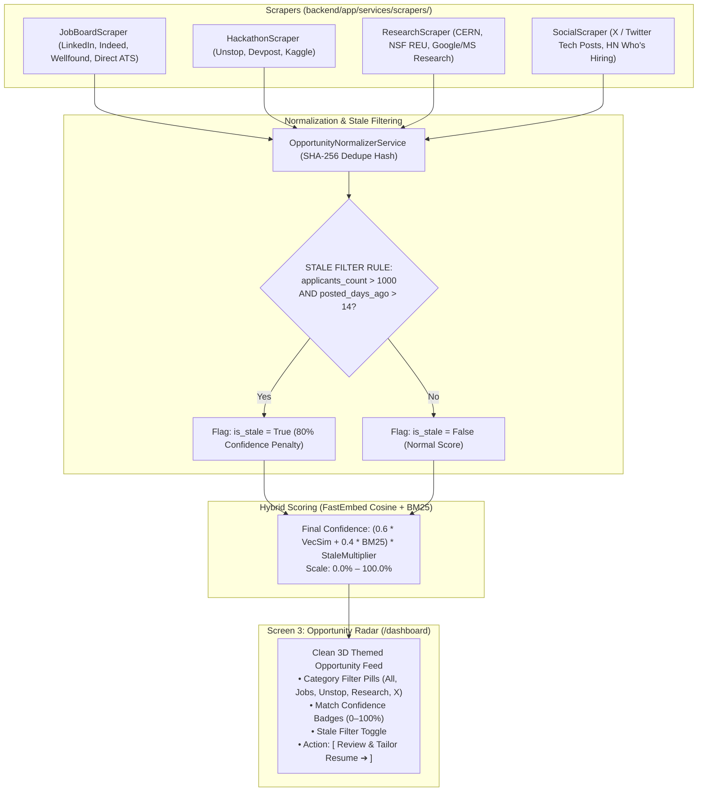
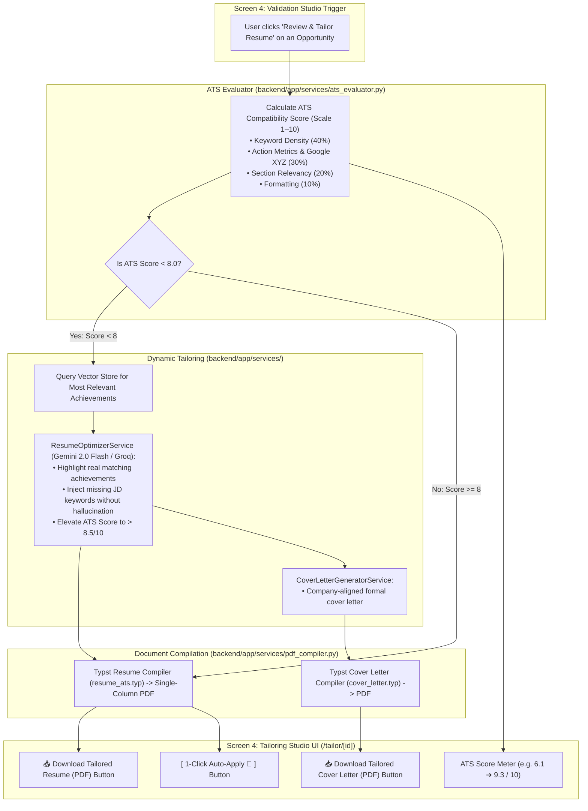
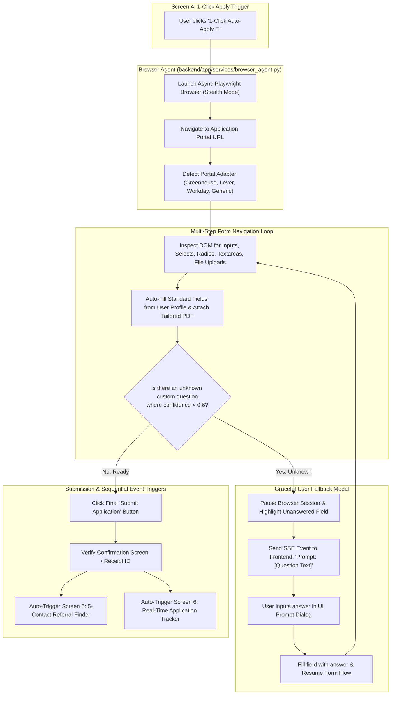
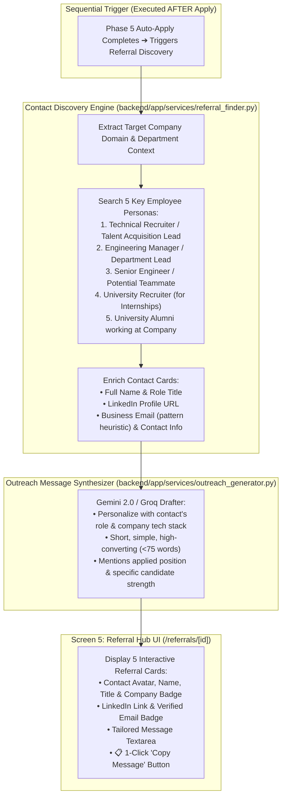
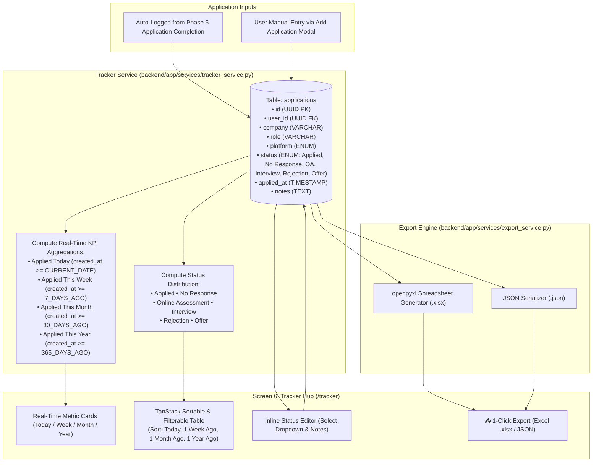

# 🛰️ getJob.ai — Master Technical Implementation Plan & Execution Tracker

```
┌────────────────────────────────────────────────────────────────────────────────────────────────────────┐
│  PROJECT: getJob.ai (getaJob.ai)                     STAGE: Architectural Blueprint & Planning         │
│  CORE ARCHITECTURE: 3D Multi-Tenant AI Career Copilot LAST UPDATED: 2026-09-15                          │
│  TOTAL PHASES: 7                                     TOTAL TASKS: 88                                   │
│  OVERALL PROGRESS: [░░░░░░░░░░░░░░░░░░░░] 0% (0/88 Tasks Completed)                                   │
└────────────────────────────────────────────────────────────────────────────────────────────────────────┘
```

> [!IMPORTANT]
> **ALIGNED WITH SIMPLIFIED 3D SITEMAP:**
> * **Screen 1:** 3D Spline Hero Portal (`fcb3d45a-1ffd-474a-afbf-9643cc3a0d40`) with center title **"Get a Job"** and **[Login]** / **[Sign Up]** modals.
> * **Screen 2:** Minimalist 3D Knowledge Base Onboarding (`67f56854-67d0-4779-b5ed-371c2f5d169e`) with dropzone for Master Resume, GitHub sync, papers, and QA bank.
> * **Subscription-Ready Architecture:** Schema includes `subscription_tier` ("free" | "pro") and `credits_remaining` for plug-and-play Stripe/payment integration later.
> * **Phases 3–7:** Streamlined Discovery Radar, ATS Tailoring Studio, 1-Click Auto-Apply, 5-Contact Referral Finder, and Real-Time Tracker.

---

## 📊 Master Phase Summary & Execution Radar

| Phase | Module Name | Lead Area | P0 (Blocker) | P1 (High) | P2 (Medium) | Total Tasks | Status |
| :---: | :--- | :--- | :---: | :---: | :---: | :---: | :---: |
| **01** | **Scaffolding, Multi-Tenant Auth & 3D Hero Portal** | Frontend 3D / Auth | 12 | 0 | 0 | **12** | `⚪ NOT STARTED` |
| **02** | **3D Knowledge Base Onboarding (RAG Engine)** | AI / RAG / Ingestion | 10 | 4 | 0 | **14** | `⚪ NOT STARTED` |
| **03** | **Multi-Channel Opportunity Discovery Radar** | Scrapers / Scoring | 4 | 7 | 1 | **12** | `⚪ NOT STARTED` |
| **04** | **Validation & ATS Tailoring Studio** | LLM / Typst PDF | 10 | 4 | 0 | **14** | `⚪ NOT STARTED` |
| **05** | **1-Click Auto-Apply Browser Engine** | Playwright / Agent | 8 | 5 | 1 | **14** | `⚪ NOT STARTED` |
| **06** | **5-Contact Referral Finder & Message Drafter** | Contact Enrichment | 3 | 5 | 2 | **10** | `⚪ NOT STARTED` |
| **07** | **Real-Time Application Tracker & Analytics** | Database / Analytics | 3 | 7 | 2 | **12** | `⚪ NOT STARTED` |
| **ALL** | **Full System Lifecycle** | **End-to-End** | **50** | **32** | **6** | **88** | `⚪ NOT STARTED` |

---

## 🗂️ Table of Contents
1. [Phase 1: Scaffolding, Multi-Tenant Auth & 3D Hero Portal](#phase-1-scaffolding-multi-tenant-auth--3d-hero-portal)
2. [Phase 2: 3D Knowledge Base Onboarding (RAG Engine)](#phase-2-3d-knowledge-base-onboarding-rag-engine)
3. [Phase 3: Multi-Channel Opportunity Discovery Radar](#phase-3-multi-channel-opportunity-discovery-radar)
4. [Phase 4: Opportunity Validation & ATS Resume/CV Tailoring Studio](#phase-4-opportunity-validation--ats-resumecv-tailoring-studio)
5. [Phase 5: Autonomous 1-Click Auto-Apply Engine (Browser Agent)](#phase-5-autonomous-1-click-auto-apply-engine-browser-agent)
6. [Phase 6: 5-Contact Referral Finder & Cold Outreach Drafter](#phase-6-5-contact-referral-finder--cold-outreach-drafter)
7. [Phase 7: Real-Time Application Tracker & Analytics Hub](#phase-7-real-time-application-tracker--analytics-hub)
8. [Comprehensive Verification & Testing Suite](#comprehensive-verification--testing-suite)

---

# Phase 1: Scaffolding, Multi-Tenant Auth & 3D Hero Portal

```
Phase Status: ⚪ NOT STARTED   |   Priority: P0 - Critical   |   Tasks: 0/12 Completed
```

### 🎯 Objective
Establish the repository, configure async database engines with subscription-ready fields (`subscription_tier`, `credits_remaining`), build JWT authentication, and build the **Screen 1: 3D Hero Portal** featuring the Spline 3D Scene (`fcb3d45a-1ffd-474a-afbf-9643cc3a0d40`), centered title **"Get a Job"**, and smooth Login/Signup action modals.

### 📐 Phase 1 Technical Implementation Flowchart


### 📋 Phase 1 Granular Task Matrix

| Task ID | Status | Priority | Target File Path | Class / Function / Component | Dependencies / Notes |
| :---: | :---: | :---: | :--- | :--- | :--- |
| `TASK-1.01` | [ ] | `P0` | `backend/requirements.txt` | Python dependency specifications | `fastapi`, `uvicorn`, `sqlalchemy`, `pydantic-settings`, `python-jose`, `passlib` |
| `TASK-1.02` | [ ] | `P0` | `frontend/package.json` | Node dependencies | `next@14`, `react@18`, `@splinetool/react-spline`, `tailwindcss`, `@radix-ui`, `zustand`, `axios` |
| `TASK-1.03` | [ ] | `backend/app/core/config.py` | `class Settings(BaseSettings)` | Loads `DATABASE_URL`, `JWT_SECRET`, `GEMINI_API_KEY`, `GROQ_API_KEY` |
| `TASK-1.04` | [ ] | `P0` | `backend/app/core/database.py` | `create_async_engine()`, `get_db_session()` | Async session generator for FastAPI dependency injection |
| `TASK-1.05` | [ ] | `P0` | `backend/app/models/user.py` | `class User(Base)` | Includes `subscription_tier` ("free") & `credits_remaining` (5) |
| `TASK-1.06` | [ ] | `P0` | `backend/app/core/security.py` | `get_password_hash()`, `verify_password()`, `create_access_token()` | Bcrypt hashing + JWT encode/decode with tenant validation |
| `TASK-1.07` | [ ] | `P0` | `backend/app/schemas/auth.py` | `UserRegisterSchema`, `UserLoginSchema`, `TokenResponse` | Pydantic v2 schemas with email & phone regex validation |
| `TASK-1.08` | [ ] | `P0` | `backend/app/api/auth.py` | `register()`, `login()`, `get_me()` | Full Auth REST endpoints with proper HTTP status codes |
| `TASK-1.09` | [ ] | `P0` | `backend/app/main.py` | `app = FastAPI()`, CORS, Router inclusion | Configures CORS origins, exception handlers, and lifecycle hooks |
| `TASK-1.10` | [ ] | `P0` | `frontend/src/app/page.tsx` | `HeroPortalView()` | **Screen 1:** Spline 3D Scene (`fcb3d45a-...`) + "Get a Job" + Auth Buttons |
| `TASK-1.11` | [ ] | `P0` | `frontend/src/components/auth-modals.tsx` | `LoginModal()`, `SignUpModal()` | Glassmorphic floating modals over the 3D canvas |
| `TASK-1.12` | [ ] | `P0` | `frontend/src/lib/auth-store.ts` | `useAuthStore` (Zustand) + Axios Interceptor | Stores JWT token & triggers auto-redirect to `/onboarding` on success |

### 🔒 Acceptance & Verification Gate
* Run `pytest tests/test_auth.py` verifying:
  - User registration creates hashed password and initializes subscription fields (`tier='free'`, `credits=5`).
  - Valid login returns JWT token.
  - Frontend renders Spline 3D Scene 1 with "Get a Job" and opens login/signup modals.

---

# Phase 2: 3D Knowledge Base Onboarding (RAG Engine)

```
Phase Status: ⚪ NOT STARTED   |   Priority: P0 - Critical   |   Tasks: 0/14 Completed
```

### 🎯 Objective
Build **Screen 2: Knowledge Base Onboarding (`/onboarding`)** with the clean 3D Spline Scene (`67f56854-67d0-4779-b5ed-371c2f5d169e`). Provide a distraction-free dropzone for Master Resume (PDF/DOCX), GitHub sync, research papers, and screening QA vault. Process with Gemini 2.0 Flash into typed JSON and vectorize in local FastEmbed (`bge-small-en-v1.5`).

### 📐 Phase 2 Technical Implementation Flowchart


### 📋 Phase 2 Granular Task Matrix

| Task ID | Status | Priority | Target File Path | Class / Function / Component | Dependencies / Notes |
| :---: | :---: | :---: | :--- | :--- | :--- |
| `TASK-2.01` | [ ] | `P0` | `backend/app/services/parsers/resume_parser.py` | `class PDFResumeParser` | `extract_text()`, `extract_sections()`, layout analysis |
| `TASK-2.02` | [ ] | `P1` | `backend/app/services/parsers/docx_parser.py` | `class DocxResumeParser` | `extract_text_from_docx()` |
| `TASK-2.03` | [ ] | `P0` | `backend/app/services/parsers/github_crawler.py` | `class GitHubRepoCrawler` | `crawl_user_repos()`, `fetch_readme()`, language stats |
| `TASK-2.04` | [ ] | `P1` | `backend/app/services/parsers/doc_parser.py` | `class AcademicDocParser` | Ingests research papers, abstracts, and course transcripts |
| `TASK-2.05` | [ ] | `P0` | `backend/app/services/ai_client.py` | `class AIClientService` | Google Gemini 2.0 Flash SDK + Groq fallback client wrapper |
| `TASK-2.06` | [ ] | `P0` | `backend/app/services/profile_structurer.py` | `class ProfileExtractionService` | Transforms raw parsed strings into structured JSON schema |
| `TASK-2.07` | [ ] | `P0` | `backend/app/services/rag_engine.py` | `class LocalRAGEngine` | `embed_text()`, `embed_batch()`, `cosine_similarity_search()` |
| `TASK-2.08` | [ ] | `P0` | `backend/app/models/profile.py` | `UserProfile`, `WorkExperience`, `Project`, `ScreeningQA` | SQLAlchemy models for storing structured knowledge base |
| `TASK-2.09` | [ ] | `P0` | `backend/app/schemas/profile.py` | `StructuredProfileSchema`, `QACreateSchema` | Pydantic models enforcing typing on all profile objects |
| `TASK-2.10` | [ ] | `P0` | `backend/app/api/profile.py` | `upload_resume()`, `sync_github()`, `get_profile_kb()` | REST endpoints for uploading and viewing knowledge base |
| `TASK-2.11` | [ ] | `P1` | `backend/app/api/qa_vault.py` | `create_qa_item()`, `list_qa_items()`, `delete_qa_item()` | Endpoints for managing screening questions & answers |
| `TASK-2.12` | [ ] | `P0` | `frontend/src/app/onboarding/page.tsx` | `KnowledgeBaseOnboardingView()` | **Screen 2:** Spline 3D Scene (`67f56854-...`) + Clean Upload Dropzone |
| `TASK-2.13` | [ ] | `P1` | `frontend/src/components/github-sync-modal.tsx` | `GitHubSyncModal()` | Minimalist modal to select top repositories to analyze |
| `TASK-2.14` | [ ] | `P1` | `frontend/src/components/qa-vault-drawer.tsx` | `QAVaultDrawer()` | Clean sliding drawer for optional screening questions |

### 🔒 Acceptance & Verification Gate
* Run `pytest tests/test_rag.py` verifying:
  - PDF/DOCX resumes are parsed without data loss.
  - Gemini 2.0 Flash outputs strict schema-compliant JSON.
  - FastEmbed generates local vector embeddings.
  - Screen 2 renders Spline 3D Scene 2 and successfully saves the profile.

---

# Phase 3: Multi-Channel Opportunity Discovery Radar

```
Phase Status: ⚪ NOT STARTED   |   Priority: P1 - High   |   Tasks: 0/12 Completed
```

### 🎯 Objective
Build **Screen 3: Opportunity Radar (`/dashboard`)** aggregating listings across Jobs (LinkedIn, Indeed, Direct ATS), Hiring Hackathons (Unstop, Devpost, Kaggle), Research Fellowships (CERN, Google/MS Research), and X/Twitter. Apply the **Stale Opportunity Filter (>1,000 applicants & >2 weeks old)** and compute 0–100% confidence scores against the User Knowledge Base.

### 📐 Phase 3 Technical Implementation Flowchart


### 📋 Phase 3 Granular Task Matrix

| Task ID | Status | Priority | Target File Path | Class / Function / Component | Dependencies / Notes |
| :---: | :---: | :---: | :--- | :--- | :--- |
| `TASK-3.01` | [ ] | `P1` | `backend/app/services/scrapers/job_scraper.py` | `class JobBoardScraper` | Scrapes LinkedIn public, Indeed, Wellfound |
| `TASK-3.02` | [ ] | `P1` | `backend/app/services/scrapers/hackathon_scraper.py` | `class HackathonScraper` | Scrapes Unstop, Devpost, Kaggle hiring competitions |
| `TASK-3.03` | [ ] | `P1` | `backend/app/services/scrapers/research_scraper.py` | `class ResearchScraper` | Scrapes CERN OpenLab, NSF REU, Google/MS Research |
| `TASK-3.04` | [ ] | `P2` | `backend/app/services/scrapers/social_scraper.py` | `class SocialSignalScraper` | Scrapes X/Twitter tech hiring threads and Hacker News |
| `TASK-3.05` | [ ] | `P1` | `backend/app/services/opportunity_normalizer.py` | `class OpportunityNormalizerService` | Generates unique SHA-256 dedupe hash & cleans HTML |
| `TASK-3.06` | [ ] | `P0` | `backend/app/services/stale_filter.py` | `class StaleFilterService` | Strict rule: `applicants > 1000 and posted_days > 14` |
| `TASK-3.07` | [ ] | `P0` | `backend/app/services/scoring_engine.py` | `class OpportunityScoringService` | Computes hybrid FastEmbed Cosine + BM25 match score |
| `TASK-3.08` | [ ] | `P1` | `backend/app/models/opportunity.py` | `class Opportunity(Base)` | Database model with platform enum, score, and stale flag |
| `TASK-3.09` | [ ] | `P1` | `backend/app/schemas/opportunity.py` | `OpportunityResponse`, `OpportunityFilterParams` | Pydantic query filters & response schemas |
| `TASK-3.10` | [ ] | `P1` | `backend/app/api/discovery.py` | `get_feed()`, `trigger_scrape()` | Endpoints for fetching scored listings feed |
| `TASK-3.11` | [ ] | `P1` | `frontend/src/app/dashboard/page.tsx` | `OpportunityRadarView()` | **Screen 3:** Clean 3D themed feed with category tabs & search |
| `TASK-3.12` | [ ] | `P1` | `frontend/src/components/opportunity-card.tsx` | `OpportunityCard()` | Renders confidence score badge, stale warning & action button |

---

# Phase 4: Opportunity Validation & ATS Resume/CV Tailoring Studio

```
Phase Status: ⚪ NOT STARTED   |   Priority: P0 - Critical   |   Tasks: 0/14 Completed
```

### 🎯 Objective
Build **Screen 4: Tailoring Studio (`/tailor/[id]`)**. Evaluates ATS score (Scale 1–10). If score is $< 8$, automatically retrieves relevant projects from RAG, injects required keywords, rewrites bullets using the Google XYZ formula, generates a custom Cover Letter, compiles ATS-perfect Typst PDFs in $<50\text{ms}$, and provides direct download buttons.

### 📐 Phase 4 Technical Implementation Flowchart


### 📋 Phase 4 Granular Task Matrix

| Task ID | Status | Priority | Target File Path | Class / Function / Component | Dependencies / Notes |
| :---: | :---: | :---: | :--- | :--- | :--- |
| `TASK-4.01` | [ ] | `P0` | `backend/app/services/ats_evaluator.py` | `class ATSEvaluatorService` | 4-pillar 1-to-10 scoring rubric with missing keyword list |
| `TASK-4.02` | [ ] | `P0` | `backend/app/services/rag_engine.py` | `get_top_projects_for_jd()` | Retrieves candidate's best matching projects from vector store |
| `TASK-4.03` | [ ] | `P0` | `backend/app/services/tailoring_engine.py` | `class ResumeOptimizerService` | Rewrites bullets into Google XYZ impact format & injects keywords |
| `TASK-4.04` | [ ] | `P1` | `backend/app/services/cover_letter_generator.py` | `class CoverLetterGeneratorService` | Generates role-targeted, company-aligned cover letter |
| `TASK-4.05` | [ ] | `P0` | `backend/app/templates/resume_ats.typ` | ATS Typst Template | Single-column, clean typography, 100% ATS parseable |
| `TASK-4.06` | [ ] | `P1` | `backend/app/templates/cover_letter.typ` | Cover Letter Typst Template | Clean executive letterhead layout |
| `TASK-4.07` | [ ] | `P0` | `backend/app/services/pdf_compiler.py` | `class PDFCompilerService` | Compiles Typst templates to binary PDF via `typst-py` (<50ms) |
| `TASK-4.08` | [ ] | `P1` | `backend/app/models/tailored_doc.py` | `TailoredDocument`, `ATSReport` | Models storing optimized resumes, cover letters, and scores |
| `TASK-4.09` | [ ] | `P1` | `backend/app/schemas/tailor.py` | `ATSReportSchema`, `TailorResponseSchema` | Pydantic schemas for scoring & tailored outputs |
| `TASK-4.10` | [ ] | `P0` | `backend/app/api/tailor.py` | `evaluate_ats()`, `optimize_resume()`, `generate_cv()` | Endpoints powering the Tailoring Studio |
| `TASK-4.11` | [ ] | `P0` | `backend/app/api/downloads.py` | `download_resume()`, `download_cv()` | Direct 1-click download endpoints returning PDF files |
| `TASK-4.12` | [ ] | `P0` | `frontend/src/app/tailor/[id]/page.tsx` | `TailoringStudioView()` | **Screen 4:** ATS score meter, keyword diff preview & download buttons |
| `TASK-4.13` | [ ] | `P1` | `frontend/src/components/resume-diff-editor.tsx` | `ResumeDiffEditor()` | Visual side-by-side diff highlighting injected keywords |
| `TASK-4.14` | [ ] | `P0` | `frontend/src/components/document-download-bar.tsx` | `DownloadActionBar()` | Direct download buttons for Tailored Resume & CV |

---

# Phase 5: Autonomous 1-Click Auto-Apply Engine (Browser Agent)

```
Phase Status: ⚪ NOT STARTED   |   Priority: P1 - High   |   Tasks: 0/14 Completed
```

### 🎯 Objective
Automate application submissions via Playwright. Gracefully walk multi-page wizard forms across Workday, Greenhouse, Lever, and custom portals, auto-fill verified candidate data, upload the tailored PDF resume, and pause with a clear user prompt for unknown custom questions.

### 📐 Phase 5 Technical Implementation Flowchart


### 📋 Phase 5 Granular Task Matrix

| Task ID | Status | Priority | Target File Path | Class / Function / Component | Dependencies / Notes |
| :---: | :---: | :---: | :--- | :--- | :--- |
| `TASK-5.01` | [ ] | `P0` | `backend/app/services/browser_agent.py` | `class PlaywrightBrowserAgent` | Manages async browser session with stealth plugin |
| `TASK-5.02` | [ ] | `P0` | `backend/app/services/form_inspector.py` | `class FormInspectorService` | Detects all interactive input fields in the DOM |
| `TASK-5.03` | [ ] | `P0` | `backend/app/services/form_mapper.py` | `class FieldMapperService` | Maps DOM labels to User KB fields |
| `TASK-5.04` | [ ] | `P1` | `backend/app/services/portal_adapters/greenhouse.py` | `class GreenhouseAdapter` | Handles Greenhouse single & multi-step forms |
| `TASK-5.05` | [ ] | `P1` | `backend/app/services/portal_adapters/lever.py` | `class LeverAdapter` | Handles Lever application pages |
| `TASK-5.06` | [ ] | `P1` | `backend/app/services/portal_adapters/workday.py` | `class WorkdayAdapter` | Handles Workday multi-page wizard navigation |
| `TASK-5.07` | [ ] | `P1` | `backend/app/services/portal_adapters/generic.py` | `class GenericFormAdapter` | Heuristic fallback DOM walker for custom portals |
| `TASK-5.08` | [ ] | `P0` | `backend/app/services/question_fallback.py` | `class QuestionFallbackHandler` | Pauses session on low confidence & notifies user |
| `TASK-5.09` | [ ] | `P1` | `backend/app/api/apply_stream.py` | `stream_application_progress()` | SSE stream sending live step updates to frontend |
| `TASK-5.10` | [ ] | `P0` | `backend/app/api/apply.py` | `start_apply()`, `submit_question_answer()` | Endpoints controlling auto-apply lifecycle |
| `TASK-5.11` | [ ] | `P1` | `frontend/src/components/auto-apply-modal.tsx` | `AutoApplyModal()` | Modal showing live progress step indicators |
| `TASK-5.12` | [ ] | `P0` | `frontend/src/components/custom-question-prompt.tsx` | `QuestionPromptDialog()` | Interactive prompt modal for answering unknown questions |
| `TASK-5.13` | [ ] | `P2` | `frontend/src/components/browser-live-preview.tsx` | `BrowserLivePreview()` | Optional live viewport screenshot viewer |
| `TASK-5.14` | [ ] | `P0` | `backend/app/services/event_bus.py` | `class ApplicationEventBus` | Automatically triggers Phase 6 & Phase 7 on submit |

---

# Phase 6: 5-Contact Referral Finder & Cold Outreach Drafter

```
Phase Status: ⚪ NOT STARTED   |   Priority: P1 - High   |   Tasks: 0/10 Completed
```

### 🎯 Objective
Build **Screen 5: 5-Contact Referral Hub (`/referrals/[id]`)**. Executed **strictly after the 1-Click Auto-Apply completes**. Discovers 5 key employee/recruiter contacts at the target company, extracts their LinkedIn profiles and contact details, and synthesizes concise, high-converting cold outreach messages with a 1-click copy action.

### 📐 Phase 6 Technical Implementation Flowchart


### 📋 Phase 6 Granular Task Matrix

| Task ID | Status | Priority | Target File Path | Class / Function / Component | Dependencies / Notes |
| :---: | :---: | :---: | :--- | :--- | :--- |
| `TASK-6.01` | [ ] | `P1` | `backend/app/services/referral_finder.py` | `extract_company_domain()` | Resolves target company domain & department |
| `TASK-6.02` | [ ] | `P1` | `backend/app/services/referral_finder.py` | `discover_five_personas()` | Identifies 5 employee personas (Recruiter, Lead, Peer, Alumni) |
| `TASK-6.03` | [ ] | `P1` | `backend/app/services/contact_enricher.py` | `class ContactEnricherService` | Enriches LinkedIn URLs and business email patterns |
| `TASK-6.04` | [ ] | `P0` | `backend/app/services/outreach_generator.py` | `class OutreachGeneratorService` | Crafts short, personalized cold messages (<75 words) |
| `TASK-6.05` | [ ] | `P1` | `backend/app/models/referral.py` | `class ReferralContact(Base)` | Database model storing contacts and generated messages |
| `TASK-6.06` | [ ] | `P1` | `backend/app/schemas/referral.py` | `ReferralContactResponse`, `ReferralListSchema` | Pydantic schemas for referral API |
| `TASK-6.07` | [ ] | `P1` | `backend/app/api/referrals.py` | `get_referrals()`, `regenerate_message()` | API endpoints for fetching and regenerating messages |
| `TASK-6.08` | [ ] | `P1` | `frontend/src/app/referrals/[id]/page.tsx` | `ReferralHubView()` | **Screen 5:** Displays 5 referral contact cards for the applied role |
| `TASK-6.09` | [ ] | `P0` | `frontend/src/components/copy-message-btn.tsx` | `CopyMessageButton()` | 1-Click clipboard copy button with visual feedback |
| `TASK-6.10` | [ ] | `P2` | `frontend/src/components/referral-card.tsx` | `ReferralCard()` | Interactive card with direct LinkedIn link & message box |

---

# Phase 7: Real-Time Application Tracker & Analytics Hub

```
Phase Status: ⚪ NOT STARTED   |   Priority: P2 - Medium   |   Tasks: 0/12 Completed
```

### 🎯 Objective
Build **Screen 6: Application Tracker & Analytics (`/tracker`)**. Real-time logging of all applications (auto-logged on submit or manually added). Compute KPI metrics (Today / Week / Month / Year), provide a sortable data table with outcome management (Rejection, Selection, No Response), and provide 1-click Excel (.xlsx) and JSON export.

### 📐 Phase 7 Technical Implementation Flowchart


### 📋 Phase 7 Granular Task Matrix

| Task ID | Status | Priority | Target File Path | Class / Function / Component | Dependencies / Notes |
| :---: | :---: | :---: | :--- | :--- | :--- |
| `TASK-7.01` | [ ] | `P1` | `backend/app/models/application.py` | `class Application(Base)` | Database model with status enums and timestamps |
| `TASK-7.02` | [ ] | `P0` | `backend/app/services/tracker_service.py` | `log_application_event()` | Real-time auto-logger called upon form submission |
| `TASK-7.03` | [ ] | `P1` | `backend/app/services/tracker_service.py` | `get_kpi_metrics()` | SQL aggregations for Today, Week, Month, Year |
| `TASK-7.04` | [ ] | `P1` | `backend/app/services/tracker_service.py` | `list_user_applications()` | Sortable query with date range & status filters |
| `TASK-7.05` | [ ] | `P1` | `backend/app/services/export_service.py` | `export_to_excel()` | Generates formatted Excel (`.xlsx`) via `openpyxl` |
| `TASK-7.06` | [ ] | `P2` | `backend/app/services/export_service.py` | `export_to_json()` | Generates structured JSON data file |
| `TASK-7.07` | [ ] | `P1` | `backend/app/schemas/tracker.py` | `ApplicationCreate`, `ApplicationUpdate`, `KPISchema` | Pydantic validation schemas |
| `TASK-7.08` | [ ] | `P1` | `backend/app/api/tracker.py` | `get_metrics()`, `list_apps()`, `create_manual()`, `patch_app()`, `export()` | REST endpoints for tracker lifecycle |
| `TASK-7.09` | [ ] | `P1` | `frontend/src/app/tracker/kpi-cards.tsx` | `KPIMetricsGrid()` | Metric cards for Today, Week, Month, Year counts |
| `TASK-7.10` | [ ] | `P1` | `frontend/src/app/tracker/data-table.tsx` | `ApplicationDataTable()` | **Screen 6:** TanStack Table with inline status dropdown & filters |
| `TASK-7.11` | [ ] | `P2` | `frontend/src/components/add-application-modal.tsx` | `AddApplicationModal()` | Dialog for adding manual application entries |
| `TASK-7.12` | [ ] | `P1` | `frontend/src/components/export-dropdown.tsx` | `ExportDropdown()` | 1-Click download triggers for Excel & JSON |

---

# Comprehensive Verification & Testing Suite

```bash
# ============================================================
# PHASE-BY-PHASE AUTOMATED TEST EXECUTION COMMANDS
# ============================================================

# 1. Verify Phase 1 (Auth, Multi-Tenancy & 3D Hero Portal)
pytest tests/test_auth.py -v

# 2. Verify Phase 2 (Knowledge Base & RAG Vector Engine)
pytest tests/test_rag.py -v

# 3. Verify Phase 3 (Discovery Scrapers & Stale Filter)
pytest tests/test_discovery.py -v

# 4. Verify Phase 4 (ATS Evaluator & Typst PDF Compiler)
pytest tests/test_tailoring.py -v

# 5. Verify Phase 5 (Playwright Browser Auto-Apply)
pytest tests/test_apply.py -v

# 6. Verify Phase 6 (5-Contact Referral Finder)
pytest tests/test_referrals.py -v

# 7. Verify Phase 7 (Real-Time Tracker & Excel Export)
pytest tests/test_tracker.py -v

# Run Full System Test Suite with Coverage
pytest tests/ -v --cov=app --cov-report=term-missing
```

---

## 📝 Changelog & Audit Record

| Date | Phase | Task ID | Description of Change | Completed By |
| :---: | :---: | :---: | :--- | :---: |
| 2026-09-15 | All | Initial | Aligned Master 88-Task Tracker with Simplified 3D Spline Sitemap & Subscription Schema | Antigravity AI |
