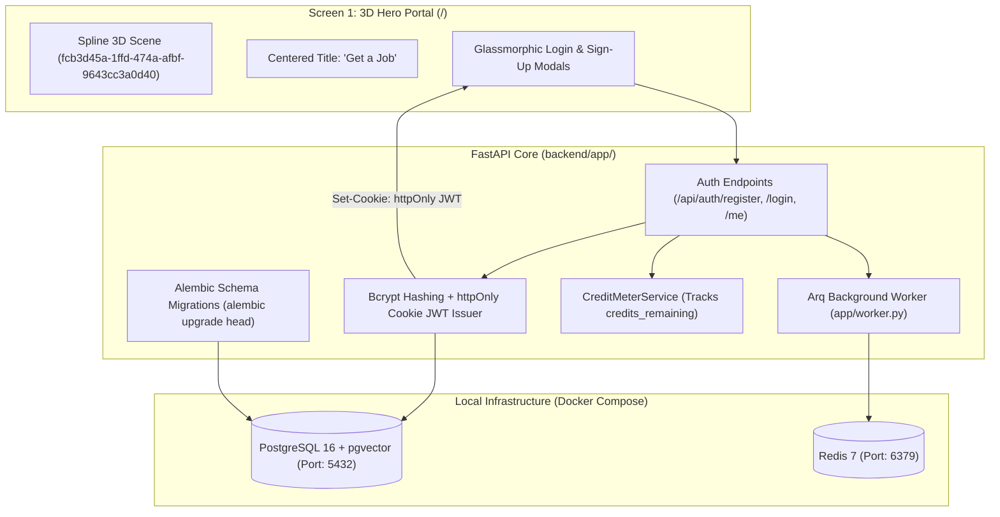
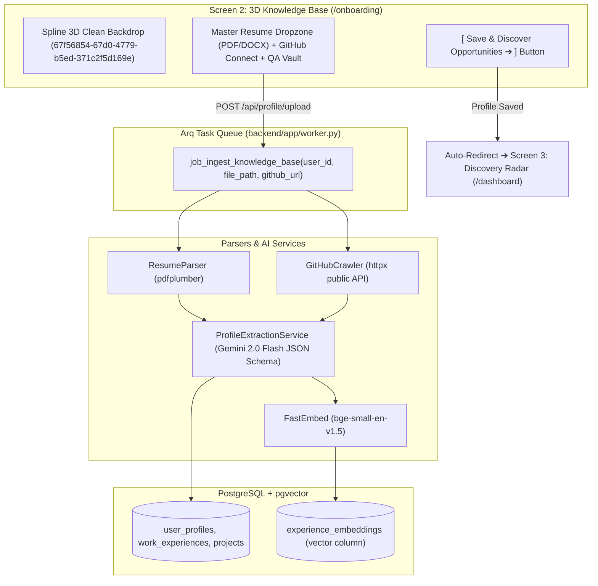
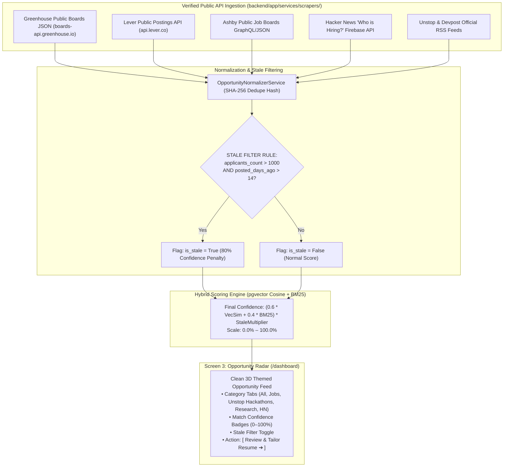
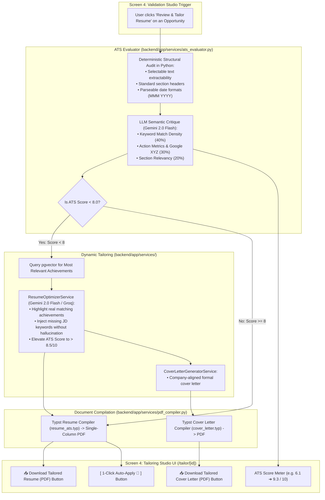
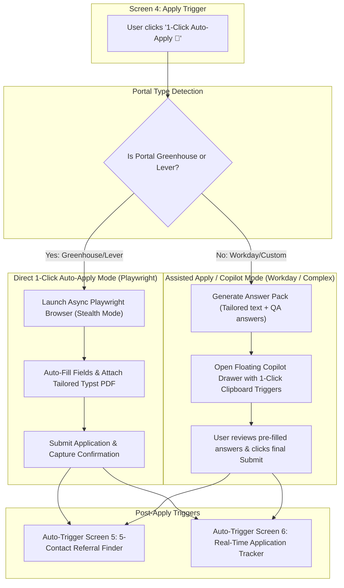
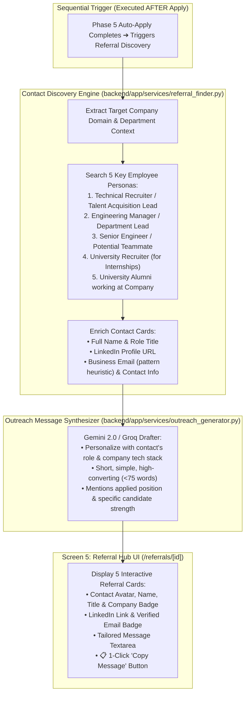
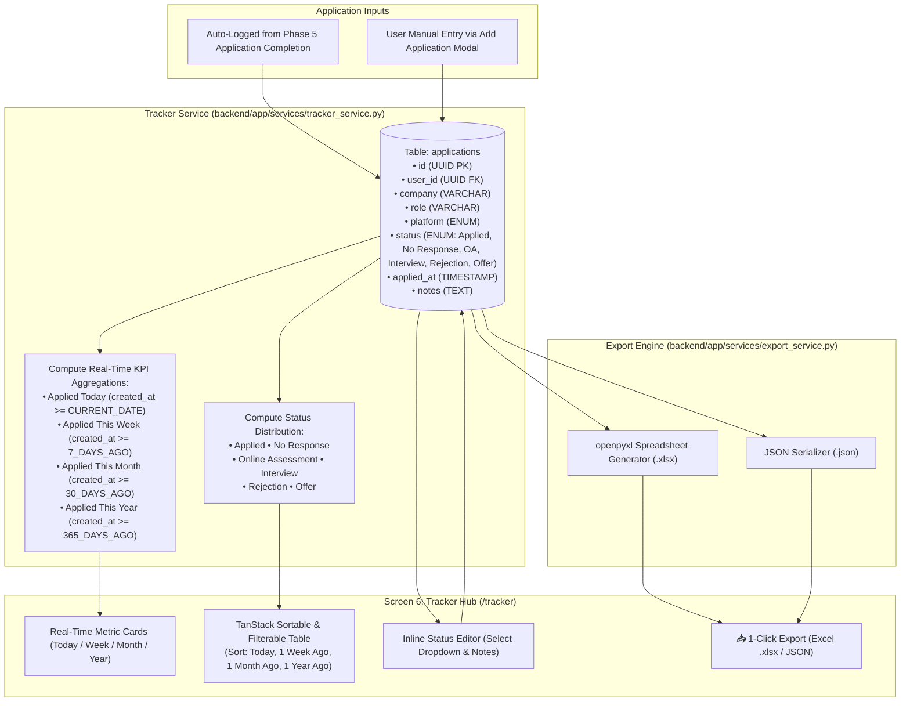

# 🛰️ getJob.ai — Master Technical Implementation Plan & Execution Tracker (Refactored)

```
┌────────────────────────────────────────────────────────────────────────────────────────────────────────┐
│  PROJECT: getJob.ai (getaJob.ai)                     STAGE: Production-Ready Roadmap                   │
│  CORE ARCHITECTURE: 3D Multi-Tenant AI Career Copilot LAST UPDATED: 2026-09-15                          │
│  TOTAL PHASES: 7 (MVP: Phases 1, 2, 3, 4, 7)         TOTAL TASKS: 88 (MVP: 48 Tasks)                   │
│  OVERALL PROGRESS: [░░░░░░░░░░░░░░░░░░░░] 0% (0/88 Tasks Completed)                                   │
└────────────────────────────────────────────────────────────────────────────────────────────────────────┘
```

> [!IMPORTANT]
> **PRODUCTION-READY REFACTORING HIGHLIGHTS:**
> * **Background Worker Queue:** Introduced `Redis + arq` to offload heavy RAG embeddings, browser sessions, and PDF compilations from the HTTP thread.
> * **Database Safety:** Added `Alembic` database migrations and a `docker-compose.yml` for PostgreSQL + `pgvector` dev/prod parity.
> * **Zero-Ban Discovery:** Pivoted from fragile HTML scraping to official/public structured JSON/RSS endpoints (Greenhouse, Lever, Ashby, Hacker News API, Unstop RSS).
> * **Hybrid Auto-Apply:** 1-Click Auto-Apply for Greenhouse & Lever + Assisted Apply Copilot for complex multi-step portals.
> * **5-Contact Referral Finder:** Retained intact — discovers 5 company contacts with LinkedIn, contact details, and personalized 1-click copy outreach messages.
> * **Security & Metering:** JWT stored in `httpOnly` secure cookies + `CreditMeterService` for per-user token and apply quota management.

---

## 📊 Master Phase Summary & Execution Radar

| Phase | Module Name | Scope Tier | Lead Area | Total Tasks | Status |
| :---: | :--- | :---: | :--- | :---: | :---: |
| **01** | **Scaffolding, Migrations, Queue & Auth** | `MVP Core - P0` | Backend / Infra / 3D | **12** | `⚪ NOT STARTED` |
| **02** | **3D Knowledge Base Onboarding (RAG)** | `MVP Core - P0` | AI / Vector / RAG | **14** | `⚪ NOT STARTED` |
| **03** | **API-Based Opportunity Radar & Scoring** | `MVP Core - P0` | APIs / Scoring / Feeds | **12** | `⚪ NOT STARTED` |
| **04** | **Validation & ATS Tailoring Studio (Typst)**| `MVP Core - P0` | Typst / LLM / PDFs | **14** | `⚪ NOT STARTED` |
| **05** | **1-Click & Assisted Auto-Apply Engine** | `Phase 2 - P1` | Playwright / Copilot | **14** | `⚪ NOT STARTED` |
| **06** | **5-Contact Referral Finder & Drafter** | `Phase 2 - P1` | Contact Enrichment | **10** | `⚪ NOT STARTED` |
| **07** | **Real-Time Tracker & Analytics Hub** | `MVP Core - P0` | Database / Analytics | **12** | `⚪ NOT STARTED` |
| **ALL** | **Full System Lifecycle** | — | **End-to-End** | **88** | `⚪ NOT STARTED` |

---

# Phase 1: Scaffolding, Migrations, Background Queue & Auth

```
Phase Status: ⚪ NOT STARTED   |   Priority: P0 - Critical (MVP Core)   |   Tasks: 0/12 Completed
```

### 🎯 Objective
Set up Dockerized PostgreSQL with `pgvector`, Redis background worker (`arq`), Alembic database migrations, `httpOnly` cookie JWT authentication, quota metering (`CreditMeterService`), and **Screen 1: 3D Spline Hero Portal (`fcb3d45a-1ffd-474a-afbf-9643cc3a0d40`)** with "Get a Job" and Login/Signup modals.

### 📐 Phase 1 Technical Implementation Flowchart


### 📋 Phase 1 Granular Task Matrix

| Task ID | Status | Priority | Target File Path | Class / Function / Component | Dependencies / Notes |
| :---: | :---: | :---: | :--- | :--- | :--- |
| `TASK-1.01` | [ ] | `P0` | `docker-compose.yml` | PostgreSQL + `pgvector` and Redis services | Local infrastructure setup with 100% dev/prod parity |
| `TASK-1.02` | [ ] | `P0` | `backend/requirements.txt` | Python dependencies | `fastapi`, `sqlalchemy`, `asyncpg`, `alembic`, `arq`, `redis`, `google-genai` |
| `TASK-1.03` | [ ] | `P0` | `backend/alembic/` | Alembic initialization & `env.py` | `alembic init alembic` with asyncpg connection |
| `TASK-1.04` | [ ] | `P0` | `backend/app/core/config.py` | `class Settings(BaseSettings)` | Loads DB URL, Redis URL, JWT Secret, Gemini API Key |
| `TASK-1.05` | [ ] | `P0` | `backend/app/core/database.py` | Async sessionmaker with `asyncpg` | Connection pool manager for PostgreSQL |
| `TASK-1.06` | [ ] | `P0` | `backend/app/models/user.py` | `class User(Base)` | Multi-tenant model with `subscription_tier` & `credits_remaining` |
| `TASK-1.07` | [ ] | `P0` | `backend/app/core/security.py` | Password hashing & `httpOnly` cookie JWT helpers | Secure SameSite cookie auth preventing XSS |
| `TASK-1.08` | [ ] | `P0` | `backend/app/services/credit_meter.py` | `class CreditMeterService` | Enforces monthly credits and rate limits per user |
| `TASK-1.09` | [ ] | `P0` | `backend/app/worker.py` | `class WorkerSettings` (Arq) | Async task worker handling offloaded background jobs |
| `TASK-1.10` | [ ] | `P0` | `backend/app/api/auth.py` | `register()`, `login()`, `get_me()`, `logout()` | Sets secure `httpOnly` cookies on login |
| `TASK-1.11` | [ ] | `P0` | `frontend/src/app/page.tsx` | `HeroPortalView()` | **Screen 1:** Spline 3D Scene (`fcb3d45a-...`) + "Get a Job" |
| `TASK-1.12` | [ ] | `P0` | `frontend/src/components/auth-modals.tsx` | `LoginModal()`, `SignUpModal()` | Glassmorphic floating modals over 3D canvas |

---

# Phase 2: 3D Knowledge Base Onboarding (RAG Engine)

```
Phase Status: ⚪ NOT STARTED   |   Priority: P0 - Critical (MVP Core)   |   Tasks: 0/14 Completed
```

### 🎯 Objective
Build **Screen 2: Knowledge Base Onboarding (`/onboarding`)** with the clean 3D Spline Scene (`67f56854-67d0-4779-b5ed-371c2f5d169e`). Ingest Master Resumes, GitHub repositories, academic papers, and screening QA vault. Process with Gemini 2.0 Flash into strict JSON and generate 384-dimensional dense embeddings in `pgvector`.

### 📐 Phase 2 Technical Implementation Flowchart


### 📋 Phase 2 Granular Task Matrix

| Task ID | Status | Priority | Target File Path | Class / Function / Component | Dependencies / Notes |
| :---: | :---: | :---: | :--- | :--- | :--- |
| `TASK-2.01` | [ ] | `P0` | `backend/app/services/parsers/resume_parser.py` | `class PDFResumeParser` | Extracts text and layout sections via `pdfplumber` |
| `TASK-2.02` | [ ] | `P1` | `backend/app/services/parsers/docx_parser.py` | `class DocxResumeParser` | Word document text extractor |
| `TASK-2.03` | [ ] | `P0` | `backend/app/services/parsers/github_crawler.py` | `class GitHubRepoCrawler` | Fetches repositories, languages, stars, and READMEs |
| `TASK-2.04` | [ ] | `P1` | `backend/app/services/parsers/doc_parser.py` | `class AcademicDocParser` | Ingests research papers, abstracts, and course transcripts |
| `TASK-2.05` | [ ] | `P0` | `backend/app/services/ai_client.py` | `class AIClientService` | Google Gemini 2.0 Flash SDK client with strict JSON schema |
| `TASK-2.06` | [ ] | `P0` | `backend/app/services/profile_structurer.py` | `class ProfileExtractionService` | Transforms parsed text into typed `StructuredProfileSchema` |
| `TASK-2.07` | [ ] | `P0` | `backend/app/services/rag_engine.py` | `class LocalRAGEngine` | Generates 384-dim embeddings via `FastEmbed` |
| `TASK-2.08` | [ ] | `P0` | `backend/app/models/profile.py` | `UserProfile`, `WorkExperience`, `Project`, `ScreeningQA` | SQLAlchemy models storing structured profile & vector embeddings |
| `TASK-2.09` | [ ] | `P0` | `backend/app/schemas/profile.py` | `StructuredProfileSchema`, `QACreateSchema` | Pydantic validation schemas |
| `TASK-2.10` | [ ] | `P0` | `backend/app/api/profile.py` | `upload_resume()`, `sync_github()`, `get_profile_kb()` | REST endpoints enqueuing ingestion tasks |
| `TASK-2.11` | [ ] | `P1` | `backend/app/api/qa_vault.py` | `create_qa_item()`, `list_qa_items()` | Manages pre-filled screening QA answers |
| `TASK-2.12` | [ ] | `P0` | `frontend/src/app/onboarding/page.tsx` | `KnowledgeBaseOnboardingView()` | **Screen 2:** Spline 3D Scene (`67f56854-...`) + Upload Dropzone |
| `TASK-2.13` | [ ] | `P1` | `frontend/src/components/github-sync-modal.tsx` | `GitHubSyncModal()` | GitHub repo selector and sync dialog |
| `TASK-2.14` | [ ] | `P1` | `frontend/src/components/qa-vault-drawer.tsx` | `QAVaultDrawer()` | Sliding drawer for screening questions & salary/visa info |

---

# Phase 3: API-Based Opportunity Discovery Radar & Scoring

```
Phase Status: ⚪ NOT STARTED   |   Priority: P0 - Critical (MVP Core)   |   Tasks: 0/12 Completed
```

### 🎯 Objective
Build **Screen 3: Opportunity Discovery Radar (`/dashboard`)**. Ingests verified opportunities via **Direct Public APIs & Feeds** (Greenhouse public JSON, Lever public API, Ashby JSON, Hacker News Firebase API, Unstop & Devpost RSS). Apply the **Stale Opportunity Filter (>1,000 applicants & >2 weeks old)** and compute 0–100% match confidence scores via `pgvector` Cosine Similarity + BM25 keyword matching.

### 📐 Phase 3 Technical Implementation Flowchart


### 📋 Phase 3 Granular Task Matrix

| Task ID | Status | Priority | Target File Path | Class / Function / Component | Dependencies / Notes |
| :---: | :---: | :---: | :--- | :--- | :--- |
| `TASK-3.01` | [ ] | `P0` | `backend/app/services/scrapers/greenhouse_api.py` | `class GreenhouseAPIClient` | Ingests public job listings from Greenhouse JSON boards |
| `TASK-3.02` | [ ] | `P0` | `backend/app/services/scrapers/lever_api.py` | `class LeverAPIClient` | Ingests public job postings from Lever API |
| `TASK-3.03` | [ ] | `P1` | `backend/app/services/scrapers/ashby_api.py` | `class AshbyAPIClient` | Ingests job postings from Ashby boards |
| `TASK-3.04` | [ ] | `P1` | `backend/app/services/scrapers/hn_api.py` | `class HackerNewsHiringClient` | Fetches monthly "Who is hiring?" jobs via Firebase API |
| `TASK-3.05` | [ ] | `P0` | `backend/app/services/scrapers/hackathon_rss.py` | `class HackathonFeedParser` | Ingests Unstop, Devpost, and Kaggle competition feeds |
| `TASK-3.06` | [ ] | `P0` | `backend/app/services/opportunity_normalizer.py` | `class OpportunityNormalizerService` | Generates SHA-256 dedupe hash & cleans descriptions |
| `TASK-3.07` | [ ] | `P0` | `backend/app/services/stale_filter.py` | `class StaleFilterService` | Strict rule: `applicants > 1000 and posted_days > 14` |
| `TASK-3.08` | [ ] | `P0` | `backend/app/services/scoring_engine.py` | `class OpportunityScoringService` | Computes hybrid `pgvector` Cosine + BM25 match score |
| `TASK-3.09` | [ ] | `P0` | `backend/app/models/opportunity.py` | `class Opportunity(Base)` | Database model storing opportunities and confidence scores |
| `TASK-3.10` | [ ] | `P0` | `backend/app/api/discovery.py` | `get_feed()`, `trigger_sync()` | Endpoints for fetching scored listings feed |
| `TASK-3.11` | [ ] | `P0` | `frontend/src/app/dashboard/page.tsx` | `OpportunityRadarView()` | **Screen 3:** Clean 3D themed feed with category tabs & search |
| `TASK-3.12` | [ ] | `P0` | `frontend/src/components/opportunity-card.tsx` | `OpportunityCard()` | Renders confidence score badge, stale warning & action button |

---

# Phase 4: Opportunity Validation & ATS Resume/CV Tailoring Studio

```
Phase Status: ⚪ NOT STARTED   |   Priority: P0 - Critical (MVP Core)   |   Tasks: 0/14 Completed
```

### 🎯 Objective
Build **Screen 4: Tailoring Studio (`/tailor/[id]`)**. Evaluates ATS score using deterministic code-based parseability + LLM keyword/impact analysis. If score is $< 8$, automatically retrieves relevant projects from RAG, injects required keywords, rewrites bullets using the Google XYZ formula, generates a custom Cover Letter, compiles ATS-perfect Typst PDFs in $<50\text{ms}$, and provides direct download buttons.

### 📐 Phase 4 Technical Implementation Flowchart


### 📋 Phase 4 Granular Task Matrix

| Task ID | Status | Priority | Target File Path | Class / Function / Component | Dependencies / Notes |
| :---: | :---: | :---: | :--- | :--- | :--- |
| `TASK-4.01` | [ ] | `P0` | `backend/app/services/ats_evaluator.py` | `class ATSEvaluatorService` | Deterministic structural audit + LLM keyword critique |
| `TASK-4.02` | [ ] | `P0` | `backend/app/services/rag_engine.py` | `get_top_projects_for_jd()` | Retrieves candidate's best matching projects via `pgvector` |
| `TASK-4.03` | [ ] | `P0` | `backend/app/services/tailoring_engine.py` | `class ResumeOptimizerService` | Rewrites bullets into Google XYZ impact format & injects keywords |
| `TASK-4.04` | [ ] | `P1` | `backend/app/services/cover_letter_gen.py` | `class CoverLetterGeneratorService` | Generates role-targeted, company-aligned cover letter |
| `TASK-4.05` | [ ] | `P0` | `backend/app/templates/resume_ats.typ` | ATS Typst Template | Single-column, clean typography, 100% ATS parseable |
| `TASK-4.06` | [ ] | `P1` | `backend/app/templates/cover_letter.typ` | Cover Letter Typst Template | Clean executive letterhead layout |
| `TASK-4.07` | [ ] | `P0` | `backend/app/services/pdf_compiler.py` | `class PDFCompilerService` | Compiles Typst templates to binary PDF via `typst-py` (<50ms) |
| `TASK-4.08` | [ ] | `P1` | `backend/app/models/tailored_doc.py` | `TailoredDocument`, `ATSReport` | Models storing optimized resumes, cover letters, and scores |
| `TASK-4.09` | [ ] | `P1` | `backend/app/schemas/tailor.py` | `ATSReportSchema`, `TailorResponseSchema` | Pydantic schemas for scoring & tailored outputs |
| `TASK-4.10` | [ ] | `P0` | `backend/app/api/tailor.py` | `evaluate_ats()`, `optimize_resume()`, `generate_cv()` | Endpoints powering the Tailoring Studio |
| `TASK-4.11` | [ ] | `P0` | `backend/app/api/downloads.py` | `download_resume()`, `download_cv()` | Direct 1-click download endpoints returning PDF files |
| `TASK-4.12` | [ ] | `P0` | `frontend/src/app/tailor/[id]/page.tsx` | `TailoringStudioView()` | **Screen 4:** ATS score meter, keyword diff preview & download buttons |
| `TASK-4.13` | [ ] | `P1` | `frontend/src/components/resume-diff-editor.tsx` | `ResumeDiffEditor()` | Visual side-by-side diff highlighting injected keywords |
| `TASK-4.14` | [ ] | `P0` | `frontend/src/components/download-bar.tsx` | `DownloadActionBar()` | Direct download buttons for Tailored Resume & CV |

---

# Phase 5: 1-Click & Assisted Auto-Apply Engine (Browser Agent)

```
Phase Status: ⚪ NOT STARTED   |   Priority: P1 - High (Post-MVP)   |   Tasks: 0/14 Completed
```

### 🎯 Objective
Automate application submissions via Playwright. Support **1-Click Direct Auto-Apply for Greenhouse & Lever** (clean single-page DOMs) and **Assisted Apply / Copilot Answer Pack for complex multi-step portals (Workday, Taleo)** to guarantee zero bot-bans.

### 📐 Phase 5 Technical Implementation Flowchart


### 📋 Phase 5 Granular Task Matrix

| Task ID | Status | Priority | Target File Path | Class / Function / Component | Dependencies / Notes |
| :---: | :---: | :---: | :--- | :--- | :--- |
| `TASK-5.01` | [ ] | `P0` | `backend/app/services/browser_agent/agent.py` | `class PlaywrightBrowserAgent` | Manages async browser session with stealth plugin |
| `TASK-5.02` | [ ] | `P0` | `backend/app/services/browser_agent/form_inspector.py` | `class FormInspectorService` | Detects input fields and file upload elements in DOM |
| `TASK-5.03` | [ ] | `P0` | `backend/app/services/browser_agent/form_mapper.py` | `class FieldMapperService` | Maps DOM labels to User KB fields |
| `TASK-5.04` | [ ] | `P0` | `backend/app/services/browser_agent/adapters/greenhouse.py` | `class GreenhouseAdapter` | Handles Greenhouse single & multi-step forms |
| `TASK-5.05` | [ ] | `P0` | `backend/app/services/browser_agent/adapters/lever.py` | `class LeverAdapter` | Handles Lever application pages |
| `TASK-5.06` | [ ] | `P1` | `backend/app/services/browser_agent/copilot_pack.py` | `class AnswerPackGenerator` | Compiles pre-filled Answer Pack for Workday/custom portals |
| `TASK-5.07` | [ ] | `P1` | `backend/app/services/browser_agent/adapters/generic.py` | `class GenericFormAdapter` | Heuristic fallback DOM walker for custom portals |
| `TASK-5.08` | [ ] | `P0` | `backend/app/services/browser_agent/question_fallback.py` | `class QuestionFallbackHandler` | Pauses session on low confidence & notifies user |
| `TASK-5.09` | [ ] | `P1` | `backend/app/api/apply_stream.py` | `stream_application_progress()` | SSE stream sending live step updates to frontend |
| `TASK-5.10` | [ ] | `P0` | `backend/app/api/apply.py` | `start_apply()`, `submit_question_answer()` | Endpoints controlling auto-apply lifecycle |
| `TASK-5.11` | [ ] | `P1` | `frontend/src/components/auto-apply-modal.tsx` | `AutoApplyModal()` | Modal showing live progress step indicators |
| `TASK-5.12` | [ ] | `P0` | `frontend/src/components/custom-q-prompt.tsx` | `QuestionPromptDialog()` | Interactive prompt modal for answering unknown questions |
| `TASK-5.13` | [ ] | `P1` | `frontend/src/components/copilot-drawer.tsx` | `AssistedApplyDrawer()` | Floating sidebar with 1-click clipboard answers for Workday |
| `TASK-5.14` | [ ] | `P0` | `backend/app/services/event_bus.py` | `class ApplicationEventBus` | Automatically triggers Phase 6 & Phase 7 on submit |

---

# Phase 6: 5-Contact Referral Finder & Cold Outreach Drafter

```
Phase Status: ⚪ NOT STARTED   |   Priority: P1 - High (Post-MVP)   |   Tasks: 0/10 Completed
```

### 🎯 Objective
Build **Screen 5: 5-Contact Referral Hub (`/referrals/[id]`)**. Executed **strictly after the Auto-Apply completes**. Discovers 5 key employee/recruiter contacts at the target company, extracts their LinkedIn profiles and contact details, and synthesizes concise, high-converting cold outreach messages with a 1-click copy action.

### 📐 Phase 6 Technical Implementation Flowchart


### 📋 Phase 6 Granular Task Matrix

| Task ID | Status | Priority | Target File Path | Class / Function / Component | Dependencies / Notes |
| :---: | :---: | :---: | :--- | :--- | :--- |
| `TASK-6.01` | [ ] | `P1` | `backend/app/services/referral_finder.py` | `extract_company_domain()` | Resolves target company domain & department |
| `TASK-6.02` | [ ] | `P1` | `backend/app/services/referral_finder.py` | `discover_five_personas()` | Identifies 5 employee personas (Recruiter, Lead, Peer, Alumni) |
| `TASK-6.03` | [ ] | `P1` | `backend/app/services/referral_finder.py` | `enrich_contact_details()` | Resolves LinkedIn URLs and business email patterns |
| `TASK-6.04` | [ ] | `P0` | `backend/app/services/outreach_generator.py` | `class OutreachGeneratorService` | Crafts short, personalized cold messages (<75 words) |
| `TASK-6.05` | [ ] | `P1` | `backend/app/models/referral.py` | `class ReferralContact(Base)` | Database model storing contacts and generated messages |
| `TASK-6.06` | [ ] | `P1` | `backend/app/schemas/referral.py` | `ReferralContactResponse`, `ReferralListSchema` | Pydantic schemas for referral API |
| `TASK-6.07` | [ ] | `P1` | `backend/app/api/referrals.py` | `get_referrals()`, `regenerate_message()` | API endpoints for fetching and regenerating messages |
| `TASK-6.08` | [ ] | `P1` | `frontend/src/app/referrals/[id]/page.tsx` | `ReferralHubView()` | **Screen 5:** Displays 5 referral contact cards for the applied role |
| `TASK-6.09` | [ ] | `P0` | `frontend/src/components/referral-card.tsx` | `CopyMessageButton()` | 1-Click clipboard copy button with visual feedback |
| `TASK-6.10` | [ ] | `P2` | `frontend/src/components/referral-card.tsx` | `ReferralCard()` | Interactive card with direct LinkedIn link & message box |

---

# Phase 7: Real-Time Application Tracker & Analytics Hub

```
Phase Status: ⚪ NOT STARTED   |   Priority: P0 - Critical (MVP Core)   |   Tasks: 0/12 Completed
```

### 🎯 Objective
Build **Screen 6: Application Tracker & Analytics (`/tracker`)**. Real-time logging of all applications (auto-logged on submit or manually added). Compute KPI metrics (Today / Week / Month / Year), provide a sortable data table with outcome management (Rejection, Selection, No Response), and provide 1-click Excel (.xlsx) and JSON export.

### 📐 Phase 7 Technical Implementation Flowchart


### 📋 Phase 7 Granular Task Matrix

| Task ID | Status | Priority | Target File Path | Class / Function / Component | Dependencies / Notes |
| :---: | :---: | :---: | :--- | :--- | :--- |
| `TASK-7.01` | [ ] | `P0` | `backend/app/models/application.py` | `class Application(Base)` | Database model with status enums and timestamps |
| `TASK-7.02` | [ ] | `P0` | `backend/app/services/tracker_service.py` | `log_application_event()` | Real-time auto-logger called upon form submission |
| `TASK-7.03` | [ ] | `P0` | `backend/app/services/tracker_service.py` | `get_kpi_metrics()` | SQL aggregations for Today, Week, Month, Year |
| `TASK-7.04` | [ ] | `P0` | `backend/app/services/tracker_service.py` | `list_user_applications()` | Sortable query with date range & status filters |
| `TASK-7.05` | [ ] | `P1` | `backend/app/services/export_service.py` | `export_to_excel()` | Generates formatted Excel (`.xlsx`) via `openpyxl` |
| `TASK-7.06` | [ ] | `P2` | `backend/app/services/export_service.py` | `export_to_json()` | Generates structured JSON data file |
| `TASK-7.07` | [ ] | `P0` | `backend/app/schemas/tracker.py` | `ApplicationCreate`, `ApplicationUpdate`, `KPISchema` | Pydantic validation schemas |
| `TASK-7.08` | [ ] | `P0` | `backend/app/api/tracker.py` | `get_metrics()`, `list_apps()`, `create_manual()`, `patch_app()`, `export()` | REST endpoints for tracker lifecycle |
| `TASK-7.09` | [ ] | `P0` | `frontend/src/app/tracker/kpi-cards.tsx` | `KPIMetricsGrid()` | Metric cards for Today, Week, Month, Year counts |
| `TASK-7.10` | [ ] | `P0` | `frontend/src/app/tracker/data-table.tsx` | `ApplicationDataTable()` | **Screen 6:** TanStack Table with inline status dropdown & filters |
| `TASK-7.11` | [ ] | `P1` | `frontend/src/components/add-application-modal.tsx` | `AddApplicationModal()` | Dialog for adding manual application entries |
| `TASK-7.12` | [ ] | `P0` | `frontend/src/components/export-dropdown.tsx` | `ExportDropdown()` | 1-Click download triggers for Excel & JSON |

---

# Comprehensive Verification & Testing Suite

```bash
# ============================================================
# PHASE-BY-PHASE AUTOMATED TEST EXECUTION COMMANDS
# ============================================================

# 1. Verify Phase 1 (Auth, Migrations, Queue & 3D Hero Portal)
pytest tests/test_auth.py -v

# 2. Verify Phase 2 (Knowledge Base & RAG Vector Engine)
pytest tests/test_rag.py -v

# 3. Verify Phase 3 (API Ingestion & Stale Filter)
pytest tests/test_discovery.py -v

# 4. Verify Phase 4 (ATS Evaluator & Typst PDF Compiler)
pytest tests/test_tailoring.py -v

# 5. Verify Phase 5 (Playwright Browser Auto-Apply)
pytest tests/test_apply.py -v

# 6. Verify Phase 6 (5-Contact Referral Finder)
pytest tests/test_referrals.py -v

# 7. Verify Phase 7 (Real-Time Tracker & Excel Export)
pytest tests/test_tracker.py -v

# Run Full System Test Suite with Coverage
pytest tests/ -v --cov=app --cov-report=term-missing
```
