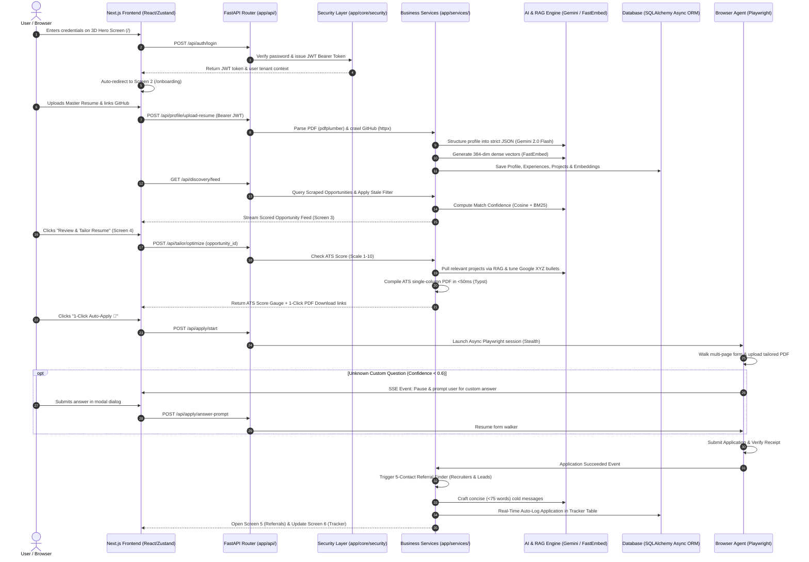

# 🗂️ getJob.ai — Complete Project Structure & Codebase Architecture

> **Document Purpose:** This document serves as the definitive reference guide for the directory organization, module responsibilities, and data flow across the **getJob.ai (getaJob.ai)** repository.

---

## 🌳 1. Master Repository Directory Tree

```
getaJob.ai/
│
├── .gitignore                          # Root ignore rules for secrets and build artifacts
├── readme.md                           # Master GitHub hero README with feature badges
│
├── Docs/                               # Architecture, planning & engineering blueprints
│   ├── workflow.md                     # Original product requirements & feature specification
│   ├── workflowArchitecture.pdf        # Visual high-level architecture diagram PDF
│   ├── sitemap.md                      # Simplified 3D user journey & screen specifications
│   ├── techStack.md                    # Finalized technology stack & library manifest
│   ├── IMPLEMENTATION_PLAN.md          # Master 88-task execution plan & phase tracker
│   └── projectStructure.md             # This document (Codebase layout reference)
│
├── backend/                            # FastAPI Python 3.11+ Async Backend
│   ├── app/
│   │   ├── api/                        # REST & SSE API Controllers (HTTP Endpoints)
│   │   │   ├── auth.py                 # Multi-tenant Auth (Register, Login, Me, Update, Delete)
│   │   │   ├── profile.py              # Knowledge Base (Resume upload, GitHub sync, Papers)
│   │   │   ├── qa_vault.py             # Screening QA Vault CRUD operations
│   │   │   ├── discovery.py            # Scored Opportunity feed & trigger scraper
│   │   │   ├── tailor.py               # ATS Score check (1–10) & resume/CV optimizer
│   │   │   ├── downloads.py            # Direct binary PDF downloads (Resume & Cover Letter)
│   │   │   ├── apply.py                # 1-Click Auto-Apply runner & prompt submission
│   │   │   ├── apply_stream.py         # Server-Sent Events (SSE) live browser progress stream
│   │   │   ├── referrals.py            # 5-Contact Referral finder & message regenerator
│   │   │   └── tracker.py              # Application KPI metrics, table CRUD & Excel export
│   │   │
│   │   ├── core/                       # Core Infrastructure, Security & Database
│   │   │   ├── config.py               # Pydantic Settings (Environment variables & API keys)
│   │   │   ├── database.py             # SQLAlchemy 2.0 Async engine & session factory
│   │   │   └── security.py             # Bcrypt password hashing & JWT token provider
│   │   │
│   │   ├── models/                     # SQLAlchemy Declarative Database Tables
│   │   │   ├── user.py                 # User model (with subscription_tier & credits)
│   │   │   ├── profile.py              # UserProfile, WorkExperience, Project, ScreeningQA
│   │   │   ├── opportunity.py          # Opportunity model (Platform enum, score, stale flag)
│   │   │   ├── tailored_doc.py         # TailoredDocument, ATSReport, CoverLetter
│   │   │   ├── referral.py             # ReferralContact model (5 personas + message draft)
│   │   │   └── application.py          # Application tracking model (Statuses, audit dates)
│   │   │
│   │   ├── schemas/                    # Pydantic v2 Request/Response Validation Schemas
│   │   │   ├── auth.py                 # Register, Login, TokenResponse, UserUpdate schemas
│   │   │   ├── profile.py              # StructuredProfile, WorkExp, Project, QASchemas
│   │   │   ├── opportunity.py          # OpportunityResponse, FilterParams schemas
│   │   │   ├── tailor.py               # ATSReportSchema, TailoredResumeResponse schemas
│   │   │   ├── referral.py             # ReferralContactResponse, ReferralListSchema
│   │   │   └── tracker.py              # ApplicationCreate, KPIMetricsResponse schemas
│   │   │
│   │   ├── services/                   # Business Logic, AI Models & Automation Engines
│   │   │   ├── ai_client.py            # Google Gemini 2.0 Flash & Groq SDK wrapper
│   │   │   ├── rag_engine.py           # FastEmbed local vector engine (RAM / 384-dim)
│   │   │   ├── profile_structurer.py   # LLM parser transforming raw data into typed JSON
│   │   │   ├── ats_evaluator.py        # 4-pillar ATS scoring engine (Scale 1–10)
│   │   │   ├── tailoring_engine.py     # Google XYZ bullet optimizer & keyword injector
│   │   │   ├── cover_letter_gen.py     # Role-targeted cover letter synthesizer
│   │   │   ├── pdf_compiler.py         # Typst PDF compiler service (<50ms compilation)
│   │   │   ├── referral_finder.py      # 5-Persona company employee discovery algorithm
│   │   │   ├── outreach_generator.py   # Concise (<75 words) cold outreach message drafter
│   │   │   ├── tracker_service.py      # Real-time auto-logger & KPI metric aggregations
│   │   │   ├── export_service.py       # openpyxl (.xlsx) & JSON export generators
│   │   │   ├── event_bus.py            # Async event dispatcher triggering post-apply steps
│   │   │   │
│   │   │   ├── parsers/                # Document Ingestion Parsers
│   │   │   │   ├── resume_parser.py    # PDF text/section layout parser (pdfplumber)
│   │   │   │   ├── docx_parser.py      # Microsoft Word resume parser (python-docx)
│   │   │   │   ├── github_crawler.py   # GitHub public API repo & README crawler
│   │   │   │   └── doc_parser.py       # Research paper & transcript course parser
│   │   │   │
│   │   │   ├── scrapers/               # Multi-Channel Discovery Scrapers
│   │   │   │   ├── job_scraper.py      # LinkedIn public, Indeed, Wellfound, Direct ATS
│   │   │   │   ├── hackathon_scraper.py# Unstop, Devpost, Kaggle hiring competitions
│   │   │   │   ├── research_scraper.py # CERN OpenLab, NSF REU, Google/MS Research
│   │   │   │   ├── social_scraper.py   # X/Twitter tech hiring threads & Hacker News
│   │   │   │   ├── normalizer.py       # SHA-256 deduplication hashing & HTML cleaner
│   │   │   │   └── stale_filter.py     # Stale rule (>1000 applicants & >2 weeks old)
│   │   │   │
│   │   │   └── browser_agent/          # Autonomous 1-Click Auto-Apply (Playwright)
│   │   │       ├── agent.py            # Async Chromium browser session manager
│   │   │       ├── form_inspector.py   # DOM interactive input/file element detector
│   │   │       ├── form_mapper.py      # Field label to User Knowledge Base resolver
│   │   │       ├── question_fallback.py# Unknown question pause & SSE notification handler
│   │   │       └── adapters/           # Specialized portal form handlers
│   │   │           ├── greenhouse.py   # Greenhouse portal adapter
│   │   │           ├── lever.py        # Lever portal adapter
│   │   │           ├── workday.py      # Workday multi-step wizard adapter
│   │   │           └── generic.py      # Generic heuristic DOM walker fallback
│   │   │
│   │   ├── templates/                  # ATS-Optimized Typst Templates
│   │   │   ├── resume_ats.typ          # Single-column machine-readable ATS resume
│   │   │   └── cover_letter.typ        # Formal executive letterhead cover letter
│   │   │
│   │   └── main.py                     # FastAPI app instance, CORS middleware & routers
│   │
│   ├── storage/                        # Persistent file caches & generated artifacts
│   │   └── generated/                  # Compiled ATS Resume & CV PDFs
│   ├── tests/                          # Automated Pytest Suite
│   ├── requirements.txt                # Python package dependencies
│   └── .env.example                    # Environment configuration template
│
└── frontend/                           # Next.js 14 App Router + TypeScript
    ├── public/                         # Static assets, favicon & icons
    ├── src/
    │   ├── app/                        # Next.js 14 App Router Page Views
    │   │   ├── page.tsx                # Screen 1: 3D Spline Hero Portal ("Get a Job")
    │   │   ├── layout.tsx              # Root HTML Layout, Theme Provider & Global Fonts
    │   │   ├── globals.css             # Tailwind CSS styles & glassmorphism variables
    │   │   │
    │   │   ├── (auth)/                 # Unauthenticated Route Group
    │   │   │   ├── login/page.tsx      # Standalone Login fallback view
    │   │   │   └── register/page.tsx   # Standalone Registration fallback view
    │   │   │
    │   │   ├── onboarding/             # Screen 2: 3D Knowledge Base Onboarding
    │   │   │   └── page.tsx            # Resume dropzone, GitHub sync & QA Vault
    │   │   │
    │   │   ├── dashboard/              # Screen 3: Opportunity Discovery Radar
    │   │   │   └── page.tsx            # Scored feeds (Jobs, Hackathons, Research, X)
    │   │   │
    │   │   ├── tailor/                 # Screen 4: Validation & ATS Tailoring Studio
    │   │   │   └── [id]/page.tsx       # ATS score meter (1-10), bullet diff & downloads
    │   │   │
    │   │   ├── referrals/              # Screen 5: 5-Contact Referral Hub
    │   │   │   └── [id]/page.tsx       # 5 Employee cards + 1-Click Copy Short Messages
    │   │   │
    │   │   └── tracker/                # Screen 6: Real-Time Tracker & Analytics
    │   │       └── page.tsx            # KPI cards (Today/Week/Month), table, Excel export
    │   │
    │   ├── components/                 # Reusable React & UI Components
    │   │   ├── 3d/                     # 3D WebGL & Spline Wrappers
    │   │   │   ├── hero-spline.tsx     # Spline Scene 1 Component (fcb3d45a-...)
    │   │   │   └── onboarding-3d.tsx   # Spline Scene 2 Component (67f56854-...)
    │   │   │
    │   │   ├── ui/                     # Shadcn UI primitives (Radix UI wrappers)
    │   │   │   ├── button.tsx
    │   │   │   ├── dialog.tsx
    │   │   │   ├── tabs.tsx
    │   │   │   ├── dropdown-menu.tsx
    │   │   │   └── toast.tsx
    │   │   │
    │   │   ├── auth-modals.tsx         # Floating Glassmorphic Login & Sign-Up Modals
    │   │   ├── opportunity-card.tsx    # Scored Opportunity card with confidence gauge
    │   │   ├── resume-diff-editor.tsx  # Side-by-side bullet diff & keyword highlighter
    │   │   ├── download-bar.tsx        # 1-Click Tailored Resume & CV download bar
    │   │   ├── auto-apply-modal.tsx    # Live Playwright browser progress stepper modal
    │   │   ├── custom-q-prompt.tsx     # Unknown question input prompt dialog
    │   │   ├── referral-card.tsx       # Referral contact card with 1-click clipboard copy
    │   │   ├── kpi-metrics-grid.tsx    # Tracker summary widgets (Today, Week, Month, Year)
    │   │   └── tracker-table.tsx       # TanStack sortable & filterable applications table
    │   │
    │   ├── lib/                        # Utility Functions & Client State
    │   │   ├── api.ts                  # Axios instance with auto JWT Bearer interceptor
    │   │   ├── auth-store.ts           # Zustand store for user session & JWT storage
    │   │   └── utils.ts                # Class merging (clsx + tailwind-merge) & formatters
    │   │
    │   └── types/                      # TypeScript Global Type Definitions
    │       ├── user.ts                 # User & Tenant interfaces
    │       ├── profile.ts              # Structured Profile, Experience, Project types
    │       ├── opportunity.ts          # Opportunity & Filter types
    │       ├── referral.ts             # Referral Contact & Message types
    │       └── tracker.ts              # Application Record & KPI types
    │
    ├── package.json                    # Node dependencies & frontend scripts
    ├── tailwind.config.ts              # Tailwind CSS theme, animations & colors
    └── tsconfig.json                   # TypeScript compiler configuration
```

---

## 🔄 2. End-to-End Data & Control Flow Architecture



---

## 📌 3. Developer Guide: Where to Add New Features

| If you want to... | Look in these directories: |
| :--- | :--- |
| **Add a new API Endpoint** | Create route in `backend/app/api/` ➔ Mount in `backend/app/main.py`. |
| **Add a new Database Table** | Define model in `backend/app/models/` ➔ Create Pydantic schema in `backend/app/schemas/`. |
| **Add a new Scraper / Job Source** | Implement scraper class in `backend/app/services/scrapers/`. |
| **Add a new Portal Adapter (e.g. Ashby)**| Implement adapter in `backend/app/services/browser_agent/adapters/`. |
| **Customize the ATS Resume Style** | Edit the Typst template in `backend/app/templates/resume_ats.typ`. |
| **Add a new Frontend Screen** | Create folder in `frontend/src/app/` (e.g. `frontend/src/app/settings/page.tsx`). |
| **Add a new 3D Scene / Spline Asset** | Add component in `frontend/src/components/3d/`. |
